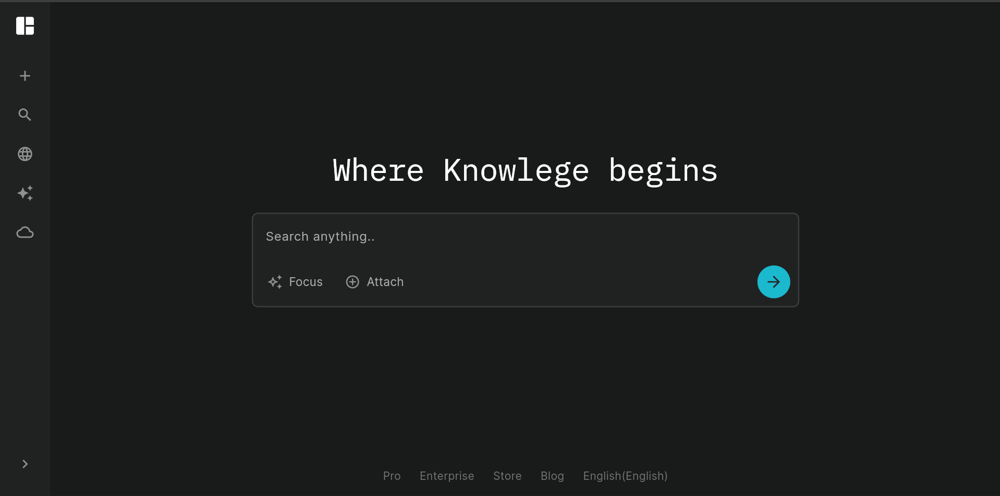
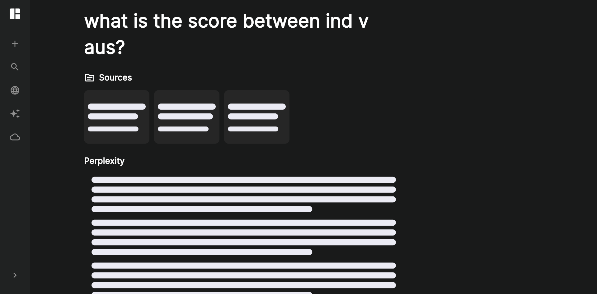
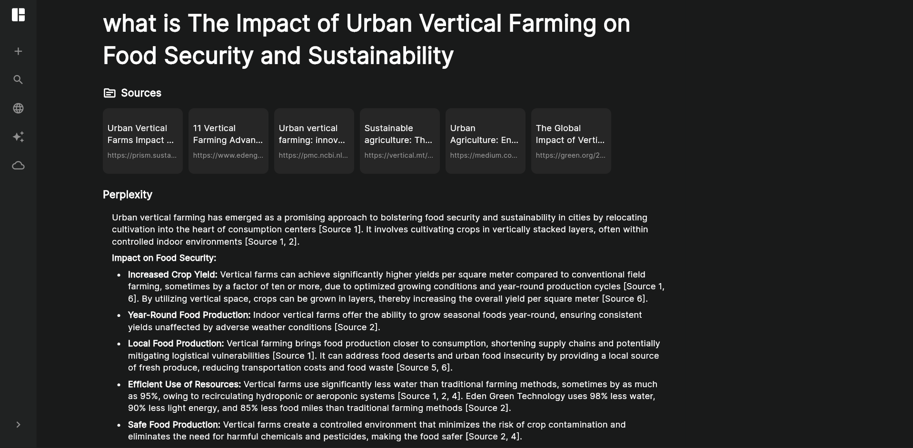

# 🤖 Perplex – Flutter RAG App with FastAPI & Google Gemini

**Perplex** is a cross-platform **Retrieval-Augmented Generation (RAG)** application built using **Flutter (web + mobile)** and **FastAPI**, powered by **Google Gemini**.  
It delivers **source-grounded**, **AI-driven** answers that users can verify through traceable citations — combining the intelligence of generative AI with the reliability of search.

---

## 🌟 Overview

Perplex bridges the gap between generative models and trustworthy information by implementing a **RAG pipeline** that:
- Retrieves relevant web or document data,
- Ranks and filters it for quality,
- Injects it into prompts for Gemini,
- Returns **contextual, verifiable answers** — all within seconds.

---

## 🧠 Key Features

- 🔎 **Retrieval-Augmented Generation (RAG):**  
  Fetches and integrates top-ranked, external context into model prompts.

- ⚡ **Fast Responses (<5s):**  
  Optimized FastAPI backend ensures sub-5-second round-trip latency.

- 🧩 **Source Citation & Traceability:**  
  Displays source URLs and metadata alongside AI-generated answers.

- 📱 **Cross-Platform:**  
  Built with Flutter to run seamlessly on **web**, **Android**, and **iOS**.

- 🌐 **Google Gemini Integration:**  
  Uses Gemini for high-fidelity, reasoning-based response generation.

---

## 🛠️ Tech Stack

| Component | Technology |
|------------|-------------|
| Frontend | **Flutter (Dart)** |
| Backend | **FastAPI (Python)** |
| AI Model | **Google Gemini API** |
| Retrieval | **Web Search / Custom Dataset Indexing (RAG)** |

---

## 📸 Screenshots

Here are some snapshots from the **Perplex App** 👇  

| Home Screen | Query Response | Source Citations |
|--------------|----------------|------------------|
|  |  |  |

---

### 🧩 App Flow

1. **User enters a query** on the Flutter app.  
2. The query is sent to the **FastAPI backend** (`/query` endpoint).  
3. Backend retrieves external data via the **RAG pipeline**.  
4. **Gemini API** processes the context and generates a grounded answer.  
5. **Response + Citations** are displayed back in the Flutter UI.

---

